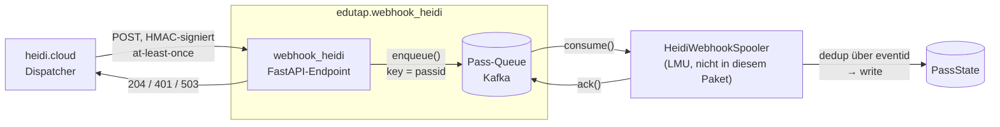
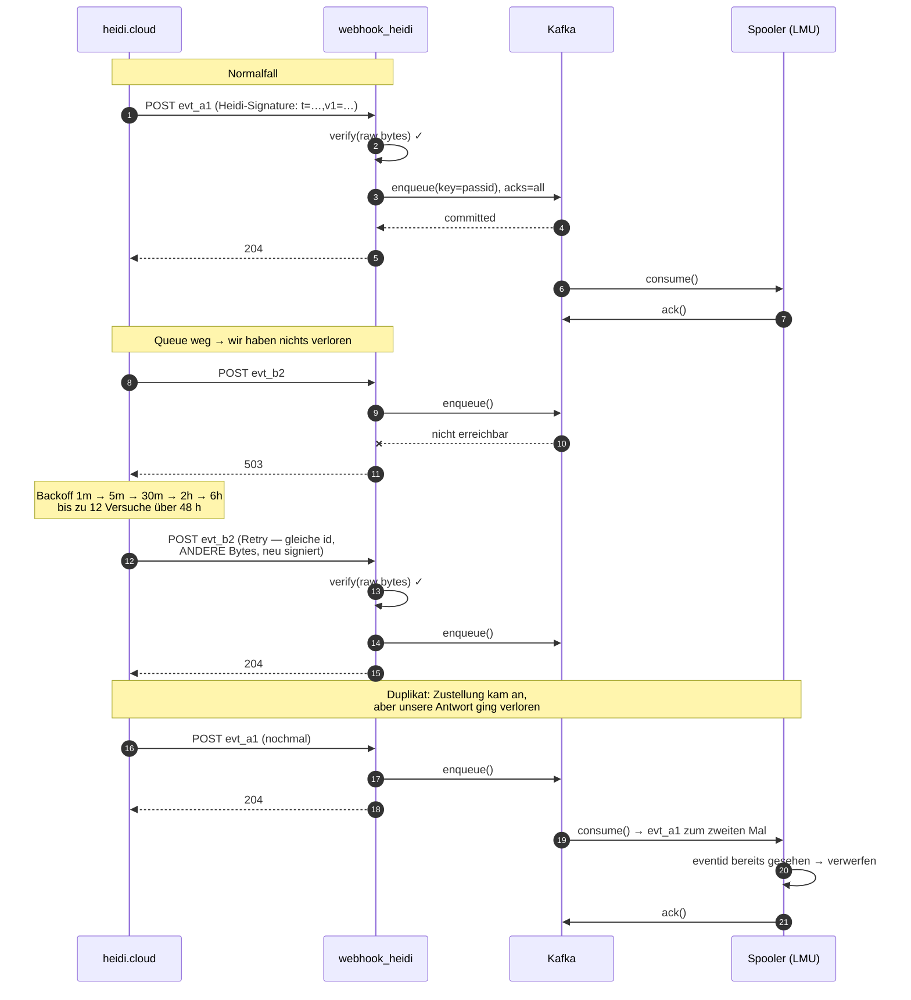
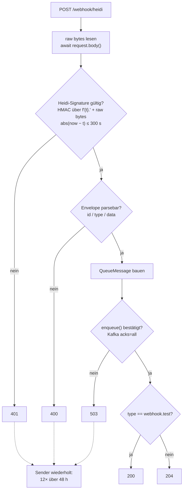

# Design: edutap.webhook_heidi

> **Stand:** 2026-07-13. Ersetzt die Annahmen in [docs/HANDOFF.md](../../HANDOFF.md),
> soweit sie dem realen heidi.cloud-Vertrag widersprechen (siehe §9).

## 1. Zweck und Abgrenzung

`edutap.webhook_heidi` ist der **Empfänger** der Customer-Webhooks von
`heidi.cloud`. Das Paket liefert zwei Dinge:

1. **Webhook-Endpoint** (FastAPI) — nimmt Pass-Events von `heidi.cloud`
   entgegen, prüft die HMAC-Signatur und schreibt sie in die Pass-Queue.
2. **Pass-Queue** — eine Abstraktion (`QueueBackend`) mit *beiden* Seiten:
   `enqueue()` für den Webhook, `consume()`/`ack()` für den Consumer.
   Ausprogrammiert wird **Kafka**; ein In-Memory-Backend dient Tests.

Nicht Teil des Pakets: jegliche Consumer-Logik hinter der Queue. Der erste
Consumer ist `lmu_edutap_full_view` mit einem eigenen `HeidiWebhookSpooler`.



Der Sender existiert bereits: heidi.cloud, Branch `feature-customer-webhooks`,
gemerged als `8e2ea2db`. **Wir definieren nichts — wir implementieren gegen einen
fertigen Vertrag.** Dessen maßgebliche Quellen:

- `heidi.cloud/docs/source/reference/api/webhooks.md` (kundenseitige Referenz)
- `heidi.cloud/src/heidi/cloud/webhooks/{dispatcher,signing}.py`
- `heidi.cloud/src/heidi/cloud/models/webhooks.py` (die Contract-Modelle)
- `heidi.cloud/tests/data/webhook_event.schema.json` (JSON-Schema, snapshot-getestet)

## 2. Der Sender-Vertrag (Referenz)

### 2.1 Request

`POST` auf die vom Kunden konfigurierte URL. Genau zwei gesetzte Header:

```
Content-Type: application/json
Heidi-Signature: t=1752422820,v1=<64 hex chars>
```

Es gibt **keinen** Event-Typ-, Delivery-ID- oder API-Version-Header. Alles steht
im Body. Redirects werden nicht gefolgt — ein 3xx von uns gilt als Fehlschlag.

### 2.2 Signatur

HMAC-SHA256, Stripe-Stil (`heidi.cloud/src/heidi/cloud/webhooks/signing.py`):

```python
digest = hmac.new(
    secret.encode(), f"{timestamp}.".encode() + body, hashlib.sha256
).hexdigest()
header = f"t={timestamp},v1={digest}"
```

- Signiert wird `f"{t}."` + **die rohen Body-Bytes**, in dieser Reihenfolge.
- Key ist das Secret als **UTF-8-String** (ein 64-stelliger Hex-String aus
  `secrets.token_hex(32)`), *nicht* aus Hex dekodiert.
- Digest ist **hex**, lowercase, 64 Zeichen. Nicht base64.
- `t` ist die Unix-Zeit **des jeweiligen Sendeversuchs**, nicht `created`.
- Empfohlene Toleranz: **300 s**, beidseitig (`abs(now - t) > 300` → ablehnen).

### 2.3 Envelope

```json
{
  "id": "evt_9f4c2a1e6b8d4f0eae7cd3a2b1f0c9e8",
  "type": "pass.installed",
  "created": "2026-07-09T12:34:56Z",
  "api_version": "2026-07-09",
  "data": {
    "pass_id": "0c0ffee0-0000-0000-0000-000000000001",
    "person_id": "12345",
    "template_id": "0c0ffee0-0000-0000-0000-000000000002",
    "template_title": "Student ID 2026",
    "preset": { "uuid": "0c0ffee0-...-0003", "title": "Student ID" },
    "wallet_type": "APPLE_ACCESS",
    "state": "ACTIVE",
    "reason": "provisioning",
    "confirmation": "device",
    "device": { "type": "1", "bundle_identifier": "a1b2c3d4e5f6..." },
    "error": null
  }
}
```

- `id` = `evt_` + 32 Hex-Zeichen. **Der Dedup-Key.**
- `type` — acht Werte: `pass.installed`, `pass.updated`, `pass.uninstalled`,
  `pass.deactivated`, `pass.suspended`, `pass.resumed`, `pass.error`,
  `webhook.test`.
- `created` — RFC 3339 UTC, in der Praxis mit Mikrosekunden und `Z`. Beim ersten
  Versuch eingefroren und über alle Retries identisch → **taugt zum Ordnen**.
- `data.state` — die Enum-**Namen**: `NEW`, `INSTALL_PENDING`, `UPDATE_PENDING`,
  `DELETE_PENDING`, `ACTIVE`, `INACTIVE`.
- `data.wallet_type` — `UNSET`, `APPLE`, `APPLE_ACCESS`, `GOOGLE`.
- `data.reason` — **offene Menge**, erweiterbar ohne Breaking Change.
- `data.confirmation` — `device` | `platform`.
- `template_id`, `template_title`, `preset`, `device`, `error` sind nullable.
  `error.category` kann `""` sein (leerer String, nicht `null`).

### 2.4 Zustellsemantik

- **Erfolg = jedes 2xx.** Der Response-Body wird **nie** gelesen.
- **Timeout: 30 s** (read/write). Danach gilt der Versuch als Fehlschlag.
- **At-least-once.** Bei Non-2xx, Connect-Error oder Timeout: bis zu **12
  Versuche** über **48 h**, Backoff 1 min → 5 min → 30 min → 2 h → 6 h (dann
  wiederholt 6 h).
- **4xx wird nicht als permanent behandelt** — auch ein 400 erzeugt 12 Retries.
- Kein Auto-Disable, keine Dead-Letter-Queue. Fehlgeschlagene Zustellungen
  bleiben 28 Tage im Delivery-Log und können vom Admin **manuell erneut
  ausgelöst** werden (gleiche `id`).
- Der Payload wird beim ersten Versuch **persistiert** und bei Retries
  unverändert erneut gesendet — aber die **Bytes können sich unterscheiden**
  (JSONB-Roundtrip: normalisierte Key-Reihenfolge, `\u`-escapes). Pro Versuch
  wird neu signiert.

### 2.5 Der Datenfluss im Zeitverlauf

Der interessante Teil ist nicht der Happy Path, sondern was ein Fehlschlag
auslöst — und warum am Ende der Consumer deduplizieren muss:



Zwei Dinge werden hier sichtbar. Erstens: Wir antworten **erst nach dem
bestätigten Kafka-Write**. Würden wir vorher 204 senden und der Write ginge
verloren, wäre das Event endgültig weg — der Sender wiederholt ja nur bei
Non-2xx. Zweitens: Der Webhook selbst dedupliziert **nicht**. Er kann es bei
Kafka gar nicht, also landet dasselbe Event ggf. mehrfach in der Queue, und der
Spooler wirft Duplikate anhand der `eventid` weg.

## 3. Architektur

### 3.1 Modul-Layout

Gespiegelt von `edutap.wallet_google` / `edutap.wallet_apple`:

```
src/edutap/webhook_heidi/
  __init__.py
  settings.py          Settings(BaseSettings), env_prefix EDUTAP_WEBHOOK_HEIDI_
  models.py            WebhookEvent (Envelope) + QueueMessage
  signing.py           verify(secret, header, raw_body, now) -> bool
  protocols.py         QueueBackend (Protocol, runtime_checkable)
  plugins.py           get_queue_backend() / add_plugin() — via Entry-Points
  queues/
    __init__.py
    memory.py          InMemoryQueueBackend  (Tests, keine Dependency)
    kafka.py           KafkaQueueBackend     (Extra [kafka], aiokafka)
  handlers/
    __init__.py
    fastapi.py         router: APIRouter
tests/
  conftest.py          entrypoints_testing-Fixture (monkeypatcht entry_points)
  plugins.py           Test-Backend-Implementierungen
```

### 3.2 QueueBackend

Die zentrale Abstraktion. Beide Seiten der Queue, damit der Consumer weder
aiokafka noch Offsets kennen muss:

```python
@runtime_checkable
class QueueBackend(Protocol):
    async def enqueue(self, message: QueueMessage) -> None:
        """Schreibt die Nachricht dauerhaft in die Queue.

        :raises QueueUnavailable: wenn der Write nicht bestätigt werden konnte.
        """

    def consume(self) -> AsyncIterator[QueueMessage]:
        """Liefert Nachrichten, bis der Consumer abbricht."""

    async def ack(self, message: QueueMessage) -> None:
        """Bestätigt die Verarbeitung (Kafka: Offset-Commit)."""
```

**Auswahl per Entry-Point** — die eduTAP-Hauskonvention (kein Env-Var-Importstring):

```toml
[project.entry-points.'edutap.webhook_heidi.plugins']
QueueBackend = 'my_consumer.queues:MyBackend'
```

`plugins.get_queue_backend()` lädt genau **einen** Backend (exakter Name, nicht
Prefix — vgl. Apples `PassDataAcquisition`), ergänzt um eine In-Process-Registry
(`add_plugin()`) für Tests. Kein Backend → `NotImplementedError`; mehrere →
Fehler.

### 3.3 Settings

**Die gesamte Konfiguration läuft über `pydantic-settings`** — es gibt keine
zweite Config-Quelle: keine YAML-Datei, kein Config-Objekt im Code, keine
`os.environ`-Zugriffe verstreut über die Module. Jeder konfigurierbare Wert ist
ein Feld auf `Settings` und damit per Env-Var (Prefix
`EDUTAP_WEBHOOK_HEIDI_…`) oder `.env` setzbar. Das entspricht auch der
Hauskonvention von `edutap.wallet_google` / `wallet_apple`.

```python
ENV_PREFIX = "EDUTAP_WEBHOOK_HEIDI_"


class Settings(BaseSettings):
    model_config = SettingsConfigDict(
        env_prefix=ENV_PREFIX,
        env_file=".env",
        env_file_encoding="utf-8",
        case_sensitive=False,
        extra="ignore",
    )

    # HTTP-Endpoint
    handler_prefix: str = "/webhook/heidi"

    # Signaturprüfung (Sender-Vertrag, §2.2)
    webhook_secret: SecretStr  # aus der heidi.cloud-Admin-UI
    signature_tolerance_seconds: int = 300

    # Enqueue — muss deutlich unter dem 30-s-Timeout des Senders bleiben
    enqueue_timeout: float = 10.0

    # Kafka-Backend (Extra [kafka])
    kafka_bootstrap_servers: str = "localhost:9092"
    kafka_topic: str = "heidi.pass-events"
    kafka_consumer_group: str = "heidi-pass-spooler"
    kafka_security_protocol: str = "PLAINTEXT"  # im LRZ vermutlich SASL_SSL
    kafka_sasl_mechanism: str | None = None
    kafka_sasl_username: str | None = None
    kafka_sasl_password: SecretStr | None = None
```

Secrets sind durchgängig `SecretStr`, damit sie nicht versehentlich in Logs oder
Tracebacks landen. `webhook_secret` hat **keinen Default** — fehlt die Env-Var,
schlägt der Start fehl, statt still mit einem unsicheren Wert zu laufen.

Zugriff wie bei den Geschwister-Paketen: `Settings()` wird dort instanziiert, wo
es gebraucht wird (kein globaler Singleton), damit Tests per Fixture überschreiben
können.

## 4. Queue-Message

```python
class QueueMessage(BaseModel):
    eventid: str  # evt_… — Dedup-Key
    passid: str  # data.pass_id
    personid: str  # data.person_id
    action: str  # type — "pass.installed" | …
    timestamp: datetime  # created (nicht die Ankunftszeit)
    payload: dict  # data, vollständig und unverändert
```

`payload` enthält `data` **unverändert** — also auch `state`, `reason`,
`wallet_type`, `template_*`, `preset`, `device`, `error`. Damit verliert der
Consumer nichts, auch wenn heidi.cloud `data` additiv erweitert.

**Kafka-Partition-Key: `passid`.** Kafka garantiert Reihenfolge nur innerhalb
einer Partition. Mit `passid` als Key landen alle Events *eines* Passes in
derselben Partition und kommen in Sendereihenfolge an — sonst könnte ein
`pass.uninstalled` vor dem zugehörigen `pass.installed` verarbeitet werden.

**Dedup ist Sache des Consumers.** Kafka kann beim Schreiben nicht
deduplizieren, also reichen wir `eventid` durch und der Spooler verwirft
Duplikate. Der Consumer sollte `eventid` mindestens 48 h vorhalten (das
Retry-Fenster), besser 28 Tage (dann sind auch Admin-Redeliveries abgedeckt).

> Randfall aus der Sender-Doku: fällt heidi.clouds interner Consumer nach dem
> Fan-out, aber vor dem Kafka-Offset-Commit aus, kann dasselbe fachliche Event
> mit **neuer** `eventid` erneut ankommen. Wer strikt dedupen will, nimmt
> zusätzlich `(action, passid, payload.state)` als Sekundärschlüssel, bei Apple
> Access erweitert um `payload.device.bundle_identifier`.

## 5. Der Endpoint

```
POST {handler_prefix}    ->  204 | 200 | 400 | 401 | 503
```



Unbekannte `type`- oder `reason`-Werte fallen **nicht** in den 400-Zweig — sie
laufen durch und landen roh im `payload` (siehe §5.1).

### 5.1 Zwei nicht offensichtliche Regeln

**Wir validieren bewusst lax.** Jedes Non-2xx löst beim Sender 12 Retries über
48 h aus — auch ein 4xx. Strenge Validierung erzeugt also keinen sauberen
Reject, sondern zwei Tage Retry-Sturm. Unbekannte `type`-Werte, unbekannte
`reason`-Werte, `error.category == ""`, fehlende optionale Felder: **alles
durchlassen**. Abgelehnt wird nur, was wir nicht kryptografisch verifizieren
können (401) oder was strukturell kein Envelope ist (400).

**2xx erst nach durable enqueue.** Würden wir vor dem bestätigten Kafka-Write
antworten, wäre ein verlorener Produce-Call ein endgültig verlorenes Event — der
Sender wiederholt ja nur bei Non-2xx. Das Zeitbudget (30 s) reicht dafür
komfortabel; `enqueue_timeout` liegt mit 10 s klar darunter.

> **Geändert am 2026-08-14:** Der ursprünglich hier beschriebene Sonderzweig
> „`webhook.test` → 200, kein Enqueue" entfällt. Der Testevent durchläuft
> denselben Pfad wie jedes andere Event; 200 bleibt nur als Marker und wird
> erst nach dem bestätigten Enqueue gesetzt. Begründung und Consumer-Vertrag:
> [`2026-08-14-webhook-test-enqueue-design.md`](2026-08-14-webhook-test-enqueue-design.md).

### 5.2 Fehlerbehandlung

| Situation | Antwort | Begründung |
|---|---|---|
| Signatur gültig, enqueued | `204` | Body wird nie gelesen |
| `webhook.test`, enqueued | `200` | enqueued wie jedes Event; 200 bleibt der Marker (siehe [2026-08-14](2026-08-14-webhook-test-enqueue-design.md)) |
| Signatur fehlt / falsch / außerhalb Toleranz | `401` | Sender retryt; deckt Secret-Rotation ab |
| Envelope strukturell kaputt | `400` | Signatur war gültig → Bug beim Sender |
| Queue nicht erreichbar, Enqueue-Timeout | `503` | Retry ist korrekt; nichts verloren — gilt auch für `webhook.test` |

### 5.3 Secret-Rotation

heidi.cloud rotiert das Secret **ohne Überlappungsfenster**. Wir halten genau
**ein** Secret und antworten bei Mismatch mit 401. Das ist tragfähig, weil der
Sender 12-mal über 48 h wiederholt und ein Admin fehlgeschlagene Zustellungen
28 Tage lang manuell erneut auslösen kann. Ein Deployment innerhalb von zwei
Tagen kostet damit kein Event.

## 6. Consumer-API

Der Consumer (LMUs `HeidiWebhookSpooler`) sieht ausschließlich das Protocol:

```python
backend = get_queue_backend()
async for message in backend.consume():
    handle(message)  # consumer-eigene Logik
    await backend.ack(message)
```

Offsets, Consumer-Group und Commit-Strategie bleiben in `queues/kafka.py`. Damit
ist das Backend auch für den Consumer austauschbar — sonst wäre er trotz
Abstraktion an aiokafka gebunden.

`handle(message)` muss Nachrichten mit `message.action == "webhook.test"`
verwerfen, statt sie wie ein echtes Pass-Event zu verarbeiten — Details und
Begründung siehe
[2026-08-14-webhook-test-enqueue-design.md](2026-08-14-webhook-test-enqueue-design.md)
§2/§3.3.

## 7. Tests

Hauskonvention ist `fastapi.testclient.TestClient` (nicht httpx-AsyncClient),
plus eine `entrypoints_testing`-Fixture, die `entry_points` in
`importlib.metadata` **und** im `plugins`-Modul monkeypatcht. Damit hängt in
Tests das `InMemoryQueueBackend` — ganz ohne Kafka.

Die Fälle, die zählen:

- **Signatur gültig** → 204, Nachricht liegt im In-Memory-Backend.
- **Retry-Bytes**: derselbe Event mit JSONB-normalisiertem JSON (andere
  Key-Reihenfolge, `\u`-escapes), neu signiert → muss **ebenfalls 204** liefern.
  Genau dieser Fall bricht jede Implementierung, die gegen re-serialisiertes
  JSON statt gegen Raw Bytes verifiziert.
- Manipulierter Body bei gültigem Header → 401.
- Timestamp 301 s alt bzw. 301 s in der Zukunft → 401.
- Unbekannter `type`, unbekannter `reason`, `error.category == ""` → 204
  (kein Fehler!).
- `webhook.test` → 200 **und** Nachricht liegt in der Queue (`action ==
  "webhook.test"`); bei kaputter Queue 503 statt 200. Geändert am
  2026-08-14, siehe
  [`2026-08-14-webhook-test-enqueue-design.md`](2026-08-14-webhook-test-enqueue-design.md).
- `enqueue()` wirft → 503.
- Kafka-Backend: Partition-Key ist `passid`; Roundtrip enqueue → consume → ack.

Für das Kafka-Backend kommt ein Service-Container in `tests.yaml` (im Handoff
bereits angekündigt). Coverage-Gate bleibt bei 90 %.

## 8. Was dieses Paket nicht tut

- Keine Dedup-Logik (Consumer-Sache, siehe §4).
- Keine Interpretation von `state`/`reason` — wir reichen `data` roh durch.
- Kein EPPN-Mapping. heidi.cloud kennt **kein EPPN**; `person_id` ist ein opaker
  String. Die Auflösung ist Consumer-Sache.
- Keine Postgres-/Redis-Backends in v1 (Extras bleiben als Platzhalter stehen).

## 9. Korrekturen am HANDOFF

Das [HANDOFF](../../HANDOFF.md) wurde vor dem Sender geschrieben und irrt in drei
Punkten:

1. **„provisioned / suspended / deactivated" sind keine States.** Der `state` im
   Payload ist `NEW | INSTALL_PENDING | UPDATE_PENDING | DELETE_PENDING | ACTIVE
   | INACTIVE`; „provisioning", „suspend" usw. sind `reason`-Werte.
2. **EPPN kommt im Payload nicht vor** — nur `person_id`.
3. **Postgres zuerst** war die Empfehlung; entschieden ist **Kafka**.

## 10. Offene Punkte

- **Consumer-Group-Name und Topic-Name** — Default `heidi.pass-events`;
  Namenskonvention mit dem LRZ-Betrieb abstimmen.
- **Partitionszahl** des Topics — bestimmt den maximalen Consumer-Parallelismus.
- **Docs-Integration** in `docs.edutap.eu`.
