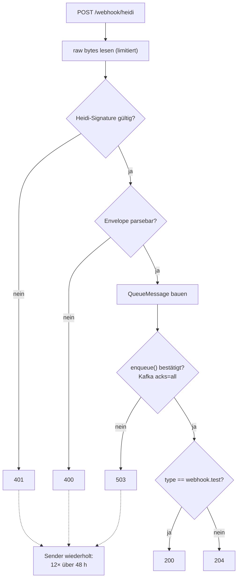

# Design: `webhook.test` wird enqueued

> **Stand:** 2026-08-14. Ändert §5.1/§5.2 des
> [Basis-Designs](2026-07-13-webhook-heidi-design.md) — der dort beschriebene
> Sonderzweig „`webhook.test` → 200, kein Enqueue" entfällt.

## 1. Anlass

Im Produktivbetrieb löst ein Testevent aus der heidi.cloud-Admin-UI im
Access-Log einen eingehenden Request aus, in Kafka landet aber nichts. Das ist
**kein verschluckter Fehler**, sondern das spezifizierte Verhalten:
`handlers/fastapi.py` kehrt bei `type == "webhook.test"` mit 200 zurück, bevor
der Enqueue-Pfad überhaupt erreicht wird.

Der Effekt: Der Konnektivitätstest testet genau die halbe Kette. Er beweist,
dass Netzwerkweg, TLS-Terminierung, Routing und Signatur stimmen — über den
Zustand des Kafka-Brokers sagt er **nichts**. Genau das ist aber die Frage, die
man beim Klick auf „Test senden" beantwortet haben will. Zusätzlich gibt es
keine Logzeile für diesen Pfad, wodurch das Verhalten von außen ununterscheidbar
von einem stillen Fehlschlag ist.

## 2. Entscheidung

`webhook.test` durchläuft ab sofort denselben Pfad wie jedes andere Event und
wird in die Queue geschrieben. Der Statuscode 200 bleibt als Marker erhalten,
gesetzt aber **erst nach** dem bestätigten Enqueue.

**Voraussetzung, außerhalb dieses Pakets:** Der Consumer muss Nachrichten mit
`action == "webhook.test"` verwerfen. Das wird hier als Vertrag festgehalten,
weil `edutap.webhook_heidi` es nicht erzwingen kann.

**Offener Punkt, Stand 2026-08-14 (gegen den Quellcode verifiziert, nicht nur
behauptet):** Beim LMU-Spooler ist dieses Verwerfen NICHT implementiert.
`_KNOWN_ACTIONS` in `spooler/heidi/handler.py` führt `"webhook.test"` sogar
explizit als bekannte Action, und `to_row()` verarbeitet laut eigenem
Kommentar bewusst JEDE Action („`action` ist ein ETIKETT, `state` ist die
Wahrheit" — ⚠️ NICHT verwerfen). `runner.py::_process` ruft
`to_row(message)` ungefiltert für jede eingehende Nachricht auf; es gibt an
keiner Stelle einen Filter. Diese Änderung darf erst ausgerollt werden,
nachdem der Consumer-seitige Fix gelandet ist — das ist eine Entscheidung des
Betreibers und außerhalb dieses Pakets.

**Bis dahin, mit dem aktuellen Consumer-Stand:** Ein Testevent hat
`state="NEW"` und `wallet_type="UNSET"` — beide validieren anstandslos.
`to_row()` liefert damit eine Zeile mit der Null-UUID als `passid` und
`person_uid = "test"`. `pass_state.person_uid` ist ein NOT-NULL-FK; der
Upsert wirft eine `IntegrityError`, die als `permanent` klassifiziert wird —
jeder Testklick in der heidi.cloud-Admin-UI erzeugt also einen DLQ-Eintrag
plus eine Error-Logzeile im Spooler, bis der Consumer-Fix nachgezogen ist.
Warum das mehr ist als nur Lograuschen, siehe §3.3.

## 3. Verhalten

### 3.1 Ablauf

Der Unterschied zum Basis-Design ist ausschließlich die Position der
`webhook.test`-Verzweigung: vorher **vor** dem Enqueue (statt seiner), jetzt
**nach** dem Enqueue (nur noch für die Wahl des Statuscodes).

### 3.2 Statuscodes

| Situation | Antwort | Begründung |
|---|---|---|
| Signatur gültig, enqueued | `204` | unverändert |
| `webhook.test`, enqueued | `200` | enqueued wie jedes Event; 200 bleibt der Marker |
| Queue nicht erreichbar, Enqueue-Timeout | `503` | **auch für `webhook.test`** |
| Signatur fehlt / falsch / außerhalb Toleranz | `401` | unverändert |
| Envelope strukturell kaputt | `400` | unverändert |
| Body über `max_body_bytes` | `413` | unverändert |

Warum 200 bleibt und nicht zu 204 vereinheitlicht wird: Der Statuscode ist die
einzige Stelle, an der im Access-Log ohne Body-Zugriff erkennbar ist, dass es
sich um einen Testklick handelte und nicht um Produktionsverkehr. Beides ist
2xx, der Sender wertet also beides als Erfolg — die Unterscheidung kostet nichts
und ist beim Debuggen wertvoll. Der OpenAPI-Vertrag bleibt dadurch ebenfalls
stabil; nur die Beschreibung des 200ers ändert sich.

Warum 503 jetzt auch für den Test gilt: Ein Konnektivitätstest, der grün meldet,
während der Broker weg ist, ist schlimmer als kein Test. Die Admin-UI zeigt den
Test damit als fehlgeschlagen an, und heidi.cloud wiederholt ihn — beides
korrekt und gewollt.

### 3.3 Kafka-seitige Auswirkungen

- **Partition-Key** ist wie bei jedem Event `passid`, beim Testevent also die
  Null-UUID `00000000-0000-0000-0000-000000000000`. `hash(Null-UUID)` fällt
  auf EINE bestimmte Partition — und dieselbe Partition trägt auch echte
  Pässe, deren `passid` zufällig auf denselben Hash abbildet. Weil `ack()`
  kumulativ ist und der Consumer streng sequenziell arbeitet (konsumieren →
  verarbeiten → acken, siehe README „Queue lesen (Spooler)"), blockiert ein
  Testevent, an dem der Consumer hängen bleibt, diese Partition — und damit
  Produktions-Pass-Events für eine beliebige Teilmenge echter Pässe, nicht
  nur den Testverkehr selbst. Das, nicht das Volumen, ist der eigentliche
  Grund, warum das Verwerfen im Consumer (§2) ein Pflichtvertrag ist und
  keine bloße Ordentlichkeit. Der Fall ist nicht hypothetisch: Beim
  LMU-Spooler ist das Verwerfen Stand 2026-08-14 nicht implementiert (§2).
  Dort begrenzt aktuell nur Glück den Schaden — `IntegrityError`
  klassifiziert als `permanent` → DLQ + `ack()` → der Spooler läuft weiter.
  Wäre dieselbe Exception als `transient` klassifiziert, würde `runner.py`
  bewusst OHNE Commit werfen und den Prozess beenden: eine
  Absturz-/Redelivery-Endlosschleife auf genau dieser Partition, ausgelöst
  durch einen einzelnen Admin-Klick auf „Test senden". Beim erwarteten
  Volumen (manuelle Klicks in der Admin-UI) bleibt lediglich die Zahl der
  betroffenen Testnachrichten selbst klein — das Blockierungsrisiko mindert
  das nicht.
- **Dedup-Key** ist `eventid`. Laut Envelope-Format (§2.3 des Basis-Designs)
  trägt jedes Event, auch `webhook.test`, eine eindeutige `evt_` +
  32-Hex-ID — das ist aus der allgemeinen Envelope-Spezifikation abgeleitet,
  nicht an echten `webhook.test`-Zustellungen beobachtet. Die bisherige
  Fixture für diesen Pfad nutzte eine konstant aussehende ID (`"evt_test"`),
  was eher in die andere Richtung deutet. Sollte heidi.cloud Testevents doch
  mit einer wiederholten ID senden, dedupliziert das folgenlos weg — die
  Konsequenz eines falschen Vorzeichens hier ist klein.
- Kein neues Topic, kein neuer Nachrichtentyp: `QueueMessage.action` trägt
  `"webhook.test"`, alle Felder sind wie gehabt belegt.

## 4. Logging

Der Erfolgsfall wird von `logger.debug` auf `logger.info` gehoben und um
`event.type` ergänzt. Grund: Bei produktionsüblichem `INFO`-Level erzeugte der
Endpoint bislang für ein *erfolgreich* verarbeitetes Event keinerlei Logzeile —
sichtbar war nur der Statuscode im Access-Log der ASGI-Schicht. Genau diese
Lücke hat die Fehlersuche in §1 unnötig verlängert. Mit `event.type` in der
Zeile ist ein Testevent auch dann erkennbar, wenn kein Access-Log vorliegt.

Die übrigen Logstufen bleiben unverändert: 401 → `warning`, 400 → `info` (ohne
Feldwerte), 413 → `warning`, 503 → `exception` mit Traceback und `event.id`.
Das Paket konfiguriert weiterhin selbst kein Logging; Level und Handler kommen
aus dem Deployment.

## 5. Umsetzung

`src/edutap/webhook_heidi/handlers/fastapi.py` — die einzige Codedatei:

1. Frühen Rücksprung `if event.type == WEBHOOK_TEST: return Response(200)`
   entfernen. `QueueMessage.from_event()` und der `try`-Block gelten damit für
   jedes Event.
2. Nach erfolgreichem Enqueue Statuscode wählen: 200 bei `WEBHOOK_TEST`,
   sonst 204.
3. `logger.debug(...)` → `logger.info(...)`, `event.type` in die Meldung.
4. OpenAPI-`responses`: Beschreibung des 200ers von „angenommen, nicht
   enqueued" auf „angenommen und enqueued" ändern.

`WEBHOOK_TEST` in `models.py` bleibt bestehen und behält seine Bedeutung; nur
der Docstring-Halbsatz „Wird angenommen, aber nicht in die Queue geschrieben"
wird korrigiert.

## 6. Tests

Alle in `tests/test_handlers_fastapi.py`, gegen `InMemoryQueueBackend`:

| Test | Prüft |
|---|---|
| `test_webhook_test_is_enqueued_and_returns_200` | 200 **und** Nachricht liegt in der Queue, `action == "webhook.test"` (ersetzt `test_webhook_test_is_accepted_but_not_enqueued`, das die Gegenaussage prüfte) |
| `test_webhook_test_yields_503_when_queue_unavailable` | Backend wirft → 503 auch für den Testevent-Pfad; bisher nur für normale Events abgedeckt |
| `test_successful_enqueue_logs_info_with_event_id` | Erfolgs-Log auf `INFO`, enthält `event.id` und `event.type` (ersetzt `..._logs_debug_...`) |

Das Testevent-Fixture wird als Modulkonstante `TEST_EVENT` herausgezogen, da es
nun in mehreren Tests gebraucht wird. Coverage-Gate bleibt bei 90 %.

## 7. Folgeänderungen in der Dokumentation

- `docs/superpowers/specs/2026-07-13-webhook-heidi-design.md`: Mermaid-Zweig
  (§5.1), Fehlertabelle §5.2, Testliste §7 — jeweils mit Verweis auf dieses
  Dokument.
- `CHANGES.md`: Korrektur des Endpoint-Eintrags unter `unreleased`, der 200
  bislang als „angenommen, aber nicht enqueued" beschreibt.

## 8. Nicht Teil dieser Änderung

- Keine Filterung oder Sonderbehandlung von `webhook.test` im Paket selbst —
  das Verwerfen ist Aufgabe des Consumers (§2).
- Kein eigenes Topic und keine eigene Queue für Testevents.
- Keine Logging-Konfiguration im Paket.
